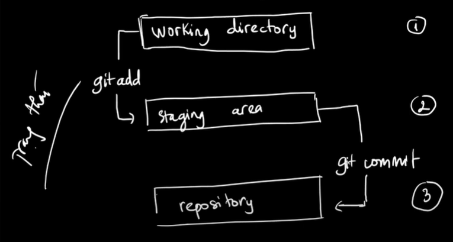

- `git init [repo name]`: create a repo
- `git clone [repo name] [clone name]`: create a copy of repo
- `git config -l` : view current config
- `git config -l [--scope] [option_name] [value]`: 
  + scope:  
    --system: all user  
    --global: relevant repos  
    --local: relevant current repo
- `git status`: show repo status, different 3 tree (Head, Index, Working directory)
- `git log`: show history commits
- `git add [file name(s)]`: add file into Index
- `git add .`: add all file in current folder
- `git commit -m "content"`: create commit -> repo
- `git diff`: different last commit

